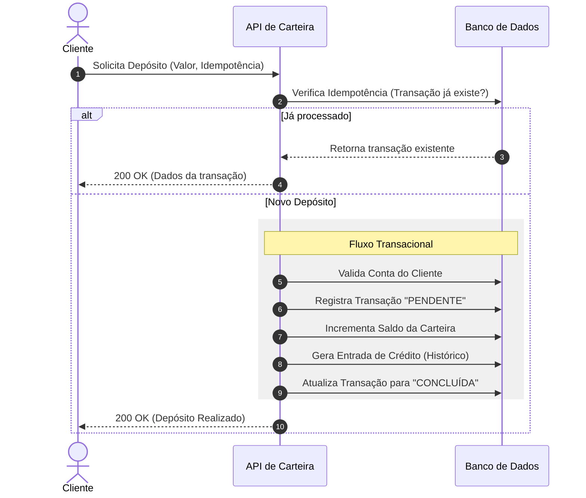

# Diagrama de Sequência: Depósito

Este diagrama descreve o fluxo de depósito em uma carteira digital, garantindo a consistência do saldo e a idempotência da transação.

```mermaid
sequenceDiagram
    autonumber
    actor Cliente
    participant API as API de Carteira
    participant DB as Banco de Dados

    Cliente->>API: Solicita Depósito (Valor, Idempotência)
    
    API->>DB: Verifica Idempotência (Transação já existe?)
    alt Já processado
        DB-->>API: Retorna transação existente
        API-->>Cliente: 200 OK (Dados da transação)
    else Novo Depósito
        rect rgb(240, 240, 240)
            Note over API, DB: Fluxo Transacional
            API->>DB: Valida Conta do Cliente
            API->>DB: Registra Transação "PENDENTE"
            API->>DB: Incrementa Saldo da Carteira
            API->>DB: Gera Entrada de Crédito (Histórico)
            API->>DB: Atualiza Transação para "CONCLUÍDA"
        end
        API-->>Cliente: 200 OK (Depósito Realizado)
    end
```
