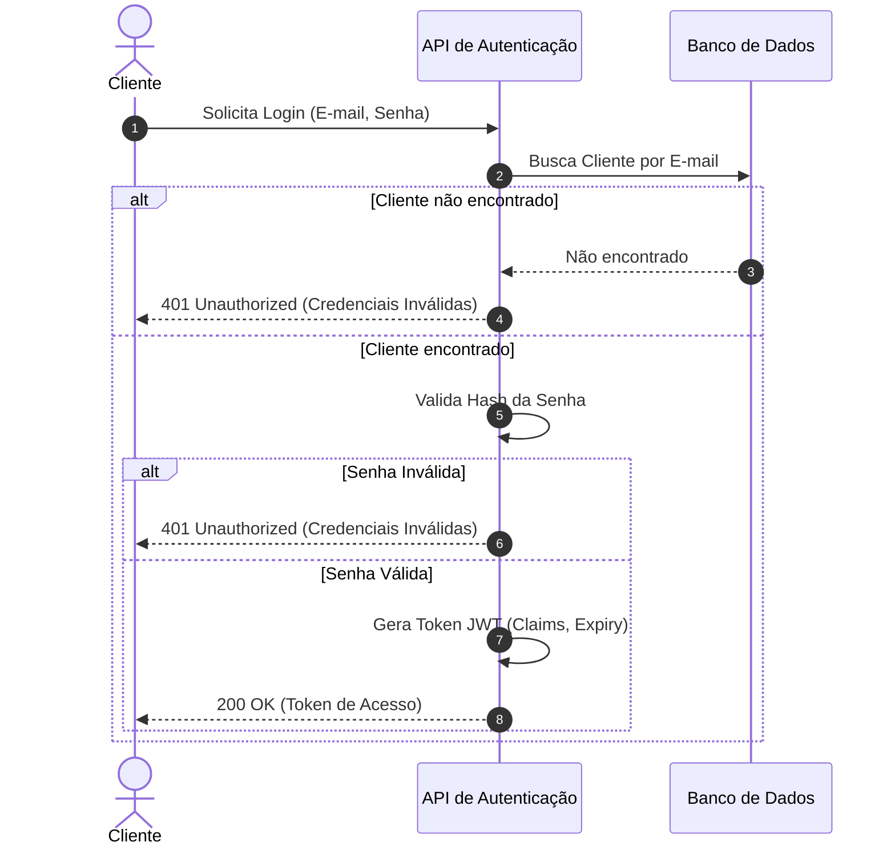

# Diagrama de Sequência: Autenticação (Login)

Este diagrama descreve o fluxo de autenticação de um cliente para obtenção de acesso seguro via token JWT.

```mermaid
sequenceDiagram
    autonumber
    actor Cliente
    participant API as API de Autenticação
    participant DB as Banco de Dados

    Cliente->>API: Solicita Login (E-mail, Senha)
    
    API->>DB: Busca Cliente por E-mail
    alt Cliente não encontrado
        DB-->>API: Não encontrado
        API-->>Cliente: 401 Unauthorized (Credenciais Inválidas)
    else Cliente encontrado
        API->>API: Valida Hash da Senha
        alt Senha Inválida
            API-->>Cliente: 401 Unauthorized (Credenciais Inválidas)
        else Senha Válida
            API->>API: Gera Token JWT (Claims, Expiry)
            API-->>Cliente: 200 OK (Token de Acesso)
        end
    end
```
