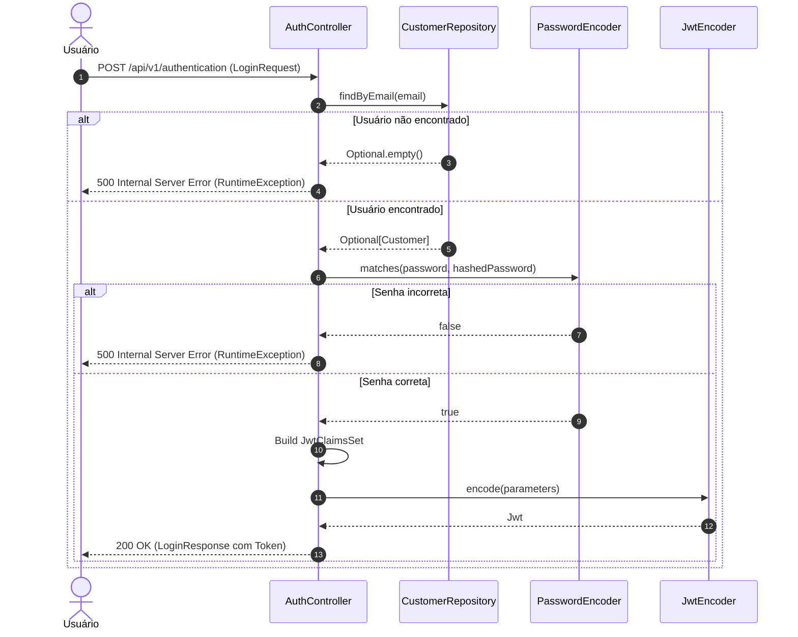

# Diagrama de Sequência: Login

Este diagrama descreve o fluxo de autenticação de um usuário para obtenção de um token JWT.

```mermaid
sequenceDiagram
    autonumber
    actor Usuário
    participant API as AuthController
    participant Repo as CustomerRepository
    participant Encoder as PasswordEncoder
    participant JWT as JwtEncoder

    Usuário->>API: POST /api/v1/authentication (LoginRequest)
    API->>Repo: findByEmail(email)
    
    alt Usuário não encontrado
        Repo-->>API: Optional.empty()
        API-->>Usuário: 500 Internal Server Error (RuntimeException)
    else Usuário encontrado
        Repo-->>API: Optional[Customer]
        API->>Encoder: matches(password, hashedPassword)
        
        alt Senha incorreta
            Encoder-->>API: false
            API-->>Usuário: 500 Internal Server Error (RuntimeException)
        else Senha correta
            Encoder-->>API: true
            API->>API: Build JwtClaimsSet
            API->>JWT: encode(parameters)
            JWT-->>API: Jwt
            API-->>Usuário: 200 OK (LoginResponse com Token)
        end
    end
```
