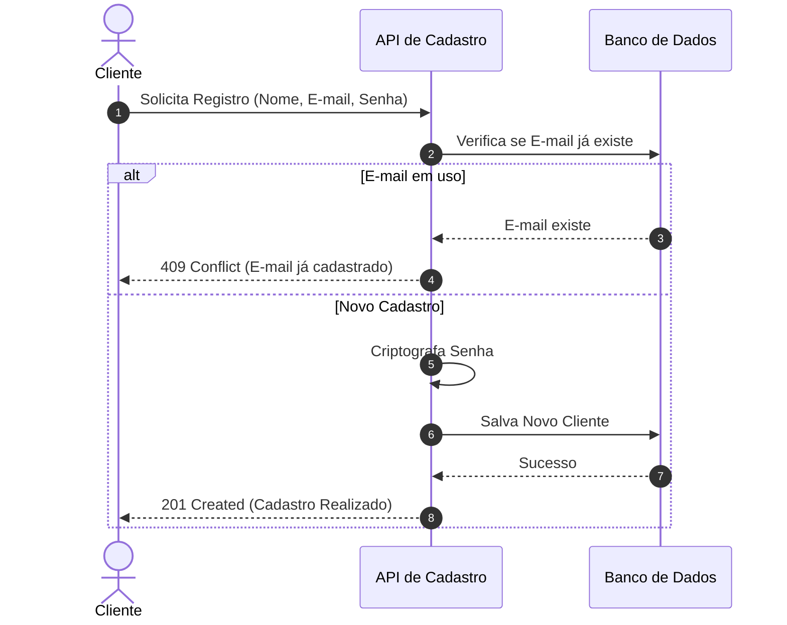

# Diagrama de Sequência: Registro de Cliente

Este diagrama descreve o fluxo de criação de uma nova conta de cliente na plataforma.

```mermaid
sequenceDiagram
    autonumber
    actor Cliente
    participant API as API de Cadastro
    participant DB as Banco de Dados

    Cliente->>API: Solicita Registro (Nome, E-mail, Senha)
    
    API->>DB: Verifica se E-mail já existe
    alt E-mail em uso
        DB-->>API: E-mail existe
        API-->>Cliente: 409 Conflict (E-mail já cadastrado)
    else Novo Cadastro
        API->>API: Criptografa Senha
        API->>DB: Salva Novo Cliente
        DB-->>API: Sucesso
        API-->>Cliente: 201 Created (Cadastro Realizado)
    end
```
