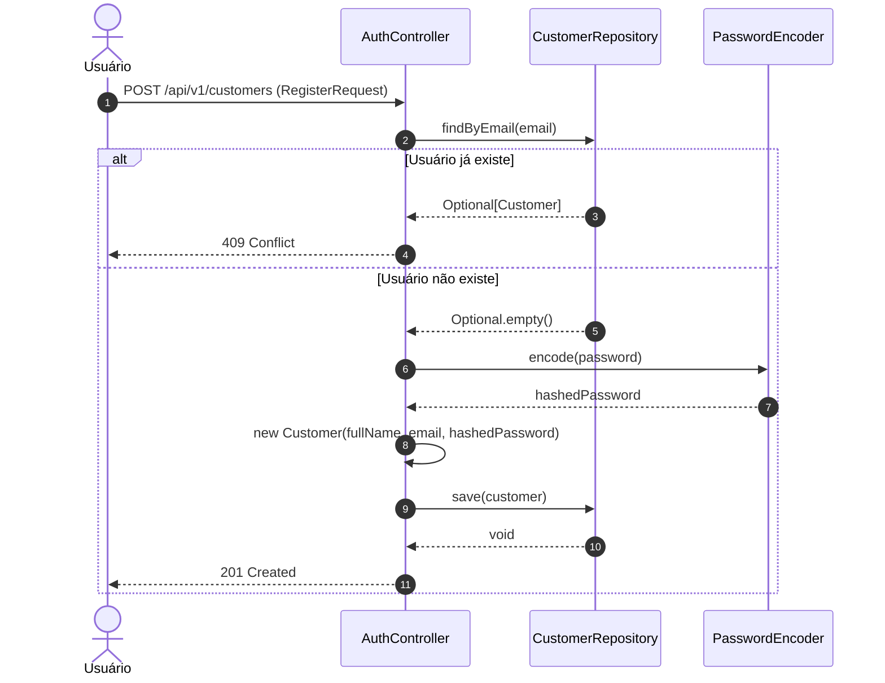

# Diagrama de Sequência: Registro de Usuário

Este diagrama descreve o fluxo de criação de uma nova conta de usuário (Customer).

```mermaid
sequenceDiagram
    autonumber
    actor Usuário
    participant API as AuthController
    participant Repo as CustomerRepository
    participant Encoder as PasswordEncoder

    Usuário->>API: POST /api/v1/customers (RegisterRequest)
    API->>Repo: findByEmail(email)
    alt Usuário já existe
        Repo-->>API: Optional[Customer]
        API-->>Usuário: 409 Conflict
    else Usuário não existe
        Repo-->>API: Optional.empty()
        API->>Encoder: encode(password)
        Encoder-->>API: hashedPassword
        API->>API: new Customer(fullName, email, hashedPassword)
        API->>Repo: save(customer)
        Repo-->>API: void
        API-->>Usuário: 201 Created
    end
```
