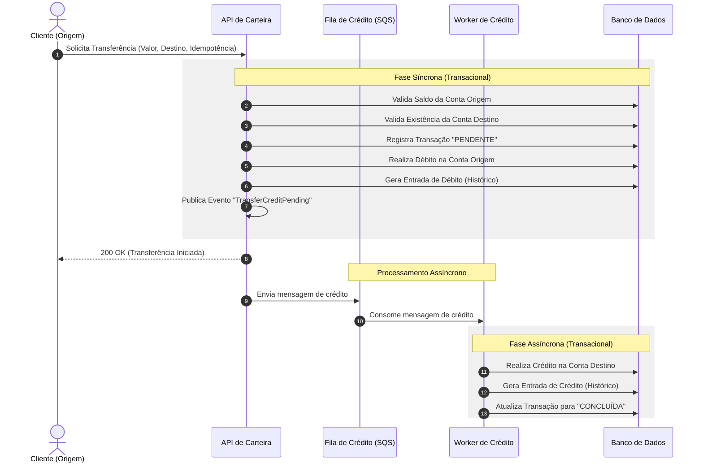

# Diagrama de Sequência: Transferência

Este diagrama descreve o fluxo de transferência entre duas carteiras digitais, destacando o processamento assíncrono do crédito.

```mermaid
sequenceDiagram
    autonumber
    actor Cliente as Cliente (Origem)
    participant API as API de Carteira
    participant SQS as Fila de Crédito (SQS)
    participant Worker as Worker de Crédito
    participant DB as Banco de Dados

    Cliente->>API: Solicita Transferência (Valor, Destino, Idempotência)
    
    rect rgb(240, 240, 240)
        Note over API, DB: Fase Síncrona (Transacional)
        API->>DB: Valida Saldo da Conta Origem
        API->>DB: Valida Existência da Conta Destino
        API->>DB: Registra Transação "PENDENTE"
        API->>DB: Realiza Débito na Conta Origem
        API->>DB: Gera Entrada de Débito (Histórico)
        API->>API: Publica Evento "TransferCreditPending"
    end

    API-->>Cliente: 200 OK (Transferência Iniciada)

    Note over SQS, Worker: Processamento Assíncrono

    API->>SQS: Envia mensagem de crédito
    SQS->>Worker: Consome mensagem de crédito

    rect rgb(240, 240, 240)
        Note over Worker, DB: Fase Assíncrona (Transacional)
        Worker->>DB: Realiza Crédito na Conta Destino
        Worker->>DB: Gera Entrada de Crédito (Histórico)
        Worker->>DB: Atualiza Transação para "CONCLUÍDA"
    end
```
