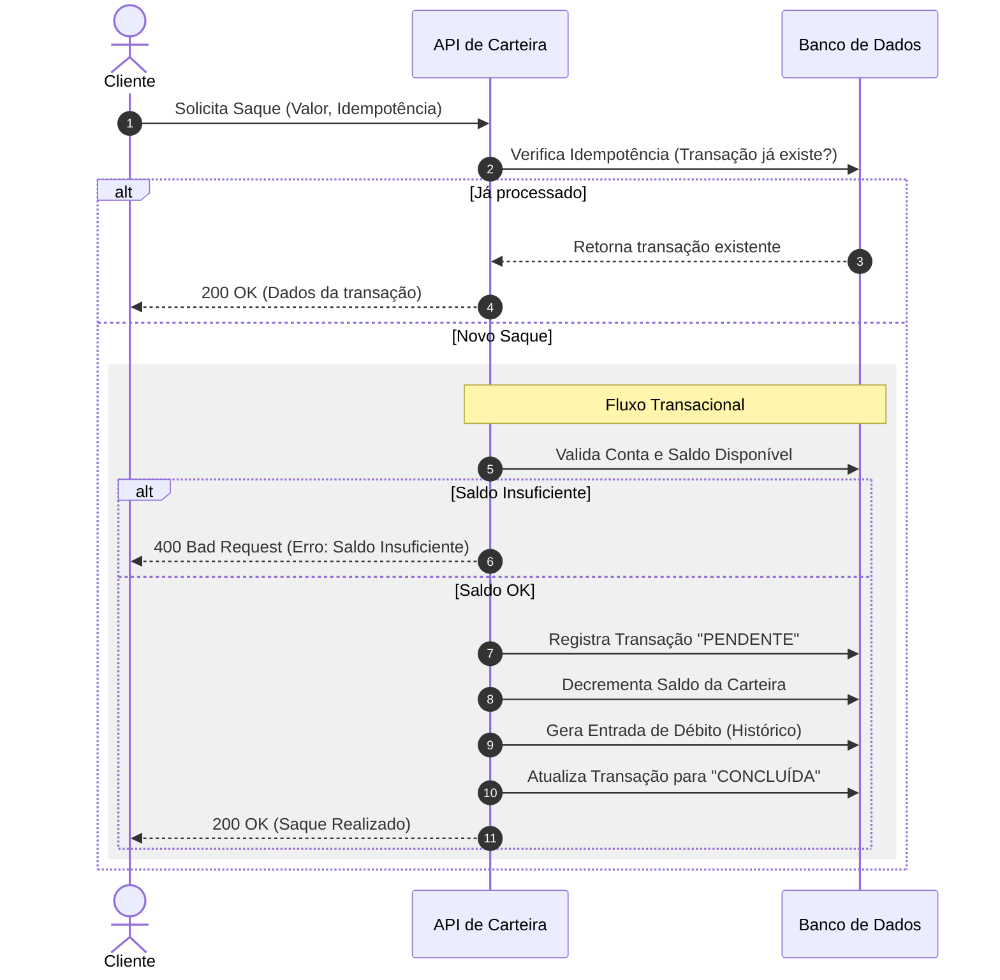

# Diagrama de Sequência: Saque (Retirada)

Este diagrama descreve o fluxo de saque de uma carteira digital, com validação de saldo e controle de idempotência.

```mermaid
sequenceDiagram
    autonumber
    actor Cliente
    participant API as API de Carteira
    participant DB as Banco de Dados

    Cliente->>API: Solicita Saque (Valor, Idempotência)
    
    API->>DB: Verifica Idempotência (Transação já existe?)
    alt Já processado
        DB-->>API: Retorna transação existente
        API-->>Cliente: 200 OK (Dados da transação)
    else Novo Saque
        rect rgb(240, 240, 240)
            Note over API, DB: Fluxo Transacional
            API->>DB: Valida Conta e Saldo Disponível
            alt Saldo Insuficiente
                API-->>Cliente: 400 Bad Request (Erro: Saldo Insuficiente)
            else Saldo OK
                API->>DB: Registra Transação "PENDENTE"
                API->>DB: Decrementa Saldo da Carteira
                API->>DB: Gera Entrada de Débito (Histórico)
                API->>DB: Atualiza Transação para "CONCLUÍDA"
                API-->>Cliente: 200 OK (Saque Realizado)
            end
        end
    end
```
