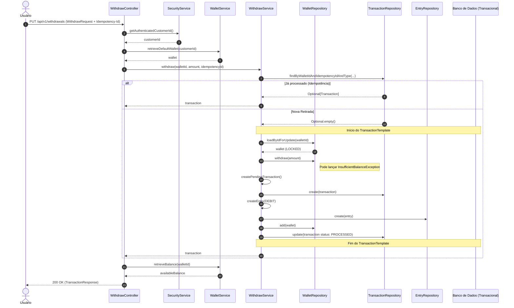

# Diagrama de Sequência: Retirada

Este diagrama descreve o fluxo de retirada (saque) de uma carteira digital.

```mermaid
sequenceDiagram
    autonumber
    actor Usuário
    participant API as WithdrawController
    participant Sec as SecurityService
    participant WS as WalletService
    participant DS as WithdrawService
    participant WR as WalletRepository
    participant TR as TransactionRepository
    participant ER as EntryRepository
    participant DB as Banco de Dados (Transacional)

    Usuário->>API: PUT /api/v1/withdrawals (WithdrawRequest + Idempotency-Id)
    API->>Sec: getAuthenticatedCustomerId()
    Sec-->>API: customerId
    API->>WS: retrieveDefaultWallet(customerId)
    WS-->>API: wallet
    
    API->>DS: withdraw(walletId, amount, idempotencyId)
    
    DS->>TR: findByWalletIdAndIdempotencyIdAndType(...)
    alt Já processado (Idempotência)
        TR-->>DS: Optional[Transaction]
        DS-->>API: transaction
    else Nova Retirada
        TR-->>DS: Optional.empty()
        
        Note over DS, DB: Início do TransactionTemplate
        DS->>WR: loadByIdForUpdate(walletId)
        WR-->>DS: wallet (LOCKED)
        
        DS->>WR: withdraw(amount)
        Note right of WR: Pode lançar InsufficientBalanceException
        
        DS->>DS: createPendingTransaction()
        DS->>TR: create(transaction)
        
        DS->>DS: createEntry(DEBIT)
        DS->>ER: create(entry)
        
        DS->>WR: add(wallet)
        
        DS->>TR: update(transaction status: PROCESSED)
        Note over DS, DB: Fim do TransactionTemplate
        
        DS-->>API: transaction
    end
    
    API->>WS: retrieveBalance(walletId)
    WS-->>API: availableBalance
    
    API-->>Usuário: 200 OK (TransactionResponse)
```
